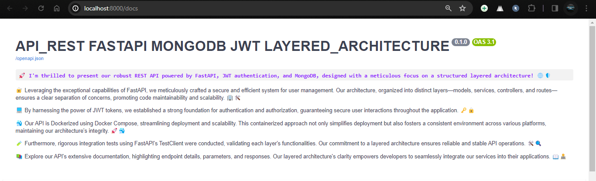
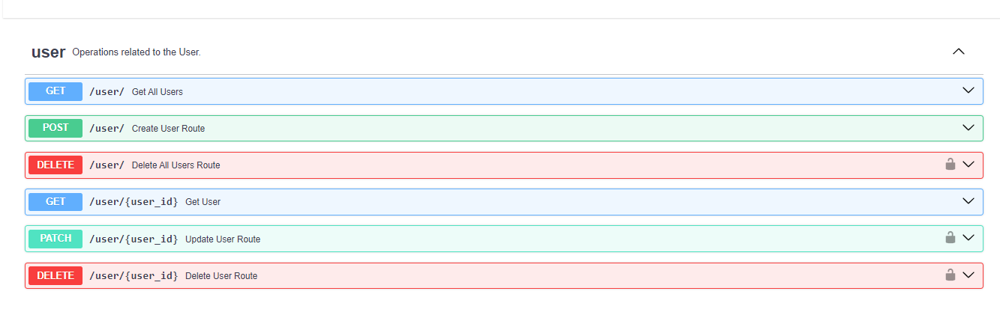
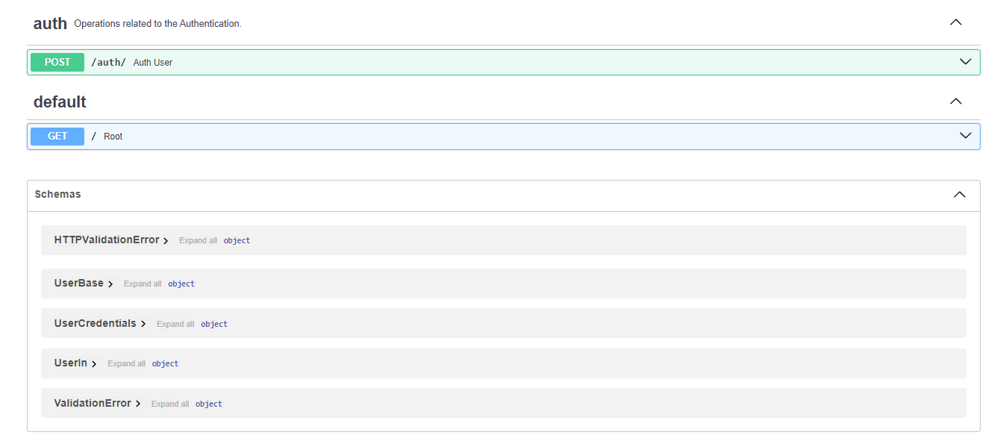

# API_REST FASTAPI MONGODB JWT LAYERED_ARCHITECTURE

##  DESCRIPTION
🚀 I'm thrilled to present our robust REST API powered by FastAPI, JWT authentication, and MongoDB, designed with a meticulous focus on a structured layered architecture! 🌐🛡️
🔐 Leveraging the exceptional capabilities of FastAPI, we meticulously crafted a secure and efficient system for user management. Our architecture, organized into distinct layers—models, services, controllers, and routes—ensures a clear separation of concerns, promoting code maintainability and scalability. 🏢🛠️

💻 By harnessing the power of JWT tokens, we established a strong foundation for authentication and authorization, guaranteeing secure user interactions throughout the application. 🗝️🔒

🐳 Our API is Dockerized using Docker Compose, streamlining deployment and scalability. This containerized approach not only simplifies deployment but also fosters a consistent environment across various platforms, maintaining our architecture's integrity. 🚀🐳

🧪 Furthermore, rigorous integration tests using FastAPI's TestClient were conducted, validating each layer's functionalities. Our commitment to a layered architecture ensures reliable and stable API operations. 🛠️🔍

📚 Explore our API's extensive documentation, highlighting endpoint details, parameters, and responses. Our layered architecture's clarity empowers developers to seamlessly integrate our services into their applications. 📖👨‍💻

## Functional Requirements:

- **User Registration:** Allow users to create new accounts by providing basic information like name, email, and password.

- **Login:** Provide a secure mechanism for users to log in using valid credentials.

- **Profile Management:** Enable user to update users information, such as changing passwords, updating name, and email

- **User Listing:** Display a list of registered users with the ability to search, filter, and sort.

- **User Deletion:** Enable user to delete acounts

- **Security & Authentication:** Ensure account security through proper password management, two-factor authentication (if necessary), and measures against attacks like SQL injection or XSS.

## Non-Functional Requirements:
- **Security:** Ensure the application complies with security standards and data protection by using encryption protocols and good security practices.

- **Performance:** Maintain optimal performance of the application by ensuring minimal load times and quick system response even under heavy loads.

- **Usability:** Design an intuitive and user-friendly interface to enhance the user experience, with simple navigation and clear understanding of functionalities.

- **Scalability:** Design the application to easily scale to handle increased user and data volumes as the application grows.

- **Maintainability:** Ensure the code is modular, easy to maintain and extend, with clear comments and a well-organized structure.

- **Compatibility:** Ensure the application is compatible with multiple browsers and devices to reach as many users as possible.

